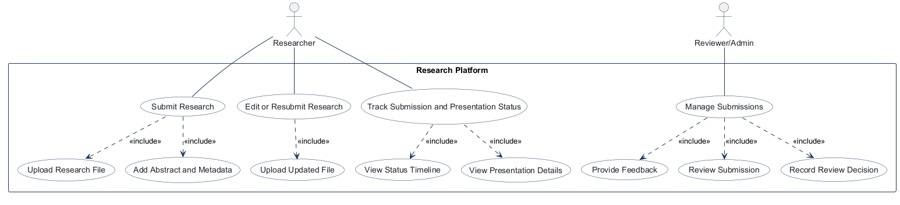
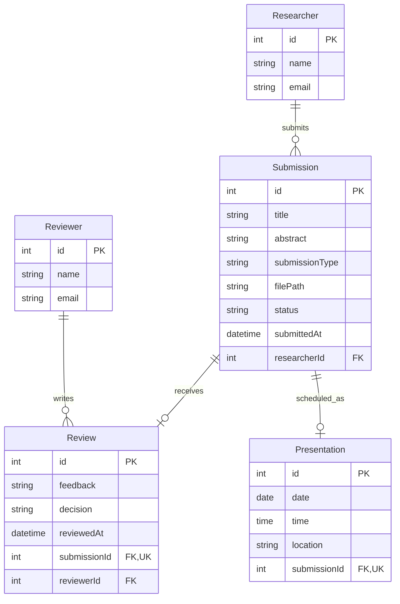

# COMP 3613 Assignment 1

Draft this file with the Guide. **Update it after every phase milestone** before you pause. The use-case diagram is a UML PNG at `docs/diagrams/use-case.png`, linked from this file as `diagrams/use-case.png` (path relative to `docs/report.md`). The model diagram is Mermaid. **Embed wireframe images** as `wireframes/<file>` (files live in `docs/wireframes/`).

Do not put your student ID in this file if you will commit it. The PDF cover adds your name and ID at export time.

## Assigned project

Research Platform

## Three workflows

### 1.
Submit research (researcher)

### 2.
Manage submissions (reviewer/admin)

### 3.
Track submission and presentation status (researcher)

## Use case diagram

Use cases kept as separate top-level flows: Submit research, Manage submissions, and Track submission and presentation status. No workflow is shared across actors. The researcher can also edit or resubmit their own submission before review as a nested step rather than a fourth top-level use case.



## Model diagram

First draft. Update this section in Phase 5 when polish revises the model, and note what changed.



Relationship and lifecycle rules: each submission belongs to one researcher, and a researcher may submit many (implied by `researcherId`). A submission has zero or one Review; `Review.submissionId` is unique, and each Review belongs to one Reviewer, who may review many submissions. A submission has zero or one Presentation; `Presentation.submissionId` is unique. `Submission.status` is separate from `Review.decision`: decisions are `Revision Required`, `Accepted`, or `Rejected`; statuses are `Submitted`, `Under Review`, `Revision Required`, `Accepted`, `Rejected`, or `Scheduled`. The review decision updates the submission status, and an accepted submission may become `Scheduled` when its Presentation is set. Field types are conventional draft assumptions inferred from the properties and can be refined later.

## Wireframes

Embed each student-crafted wireframe here (Phase 4). Paths are relative to this file:

```markdown
### Explore / Search Publications


```

`python manage.py report` also embeds any PNG/JPG still missing from `docs/wireframes/`.

## Theming

Branding preferences and how they were applied (landing / login / register).

## Implementation notes

One named workflow at a time. Include verify notes and polish / model revisions (Phase 5). Do not treat the first build as final.

## Deployed app

Phase 6. Public Render URL (not localhost). Markers open this to mark the three workflows.

https://

## Logins

Every account a marker needs, including extra users you added. Starter accounts:

- bob / bobpass — regular user
- admin / adminpass — admin

## YouTube URL

## Session transcripts

Filled when the Guide builds the report: the agent writes each Guide chat to `docs/transcripts/<slug>.md` (Copilot Agent, Cursor, or OpenCode). `python manage.py report` packages them. Do not paste chats here during the build.

## Competency (student-judge)

Filled when the report is built. Guide runs student-judge, writes `docs/judge.md`, and export appends the scorecard here.

## Skill integrity

Filled by `python manage.py report`. Do not edit the course skills.
