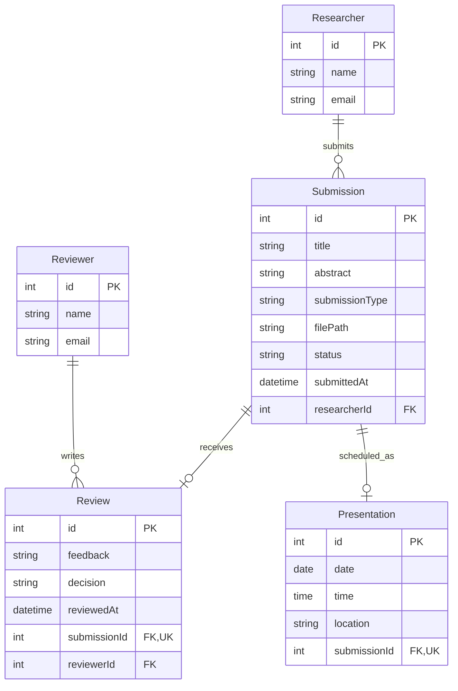

# COMP 3613 Assignment 1

Draft this file with the Guide. **Update it after every phase milestone** before you pause. The use-case diagram is a UML PNG at `docs/diagrams/use-case.png`, linked from this file as `diagrams/use-case.png` (path relative to `docs/report.md`). The model diagram is Mermaid. **Embed wireframe images** as `wireframes/<file>` (files live in `docs/wireframes/`).

Do not put your student ID in this file if you will commit it. The PDF cover adds your name and ID at export time.

## Assigned project

Research Platform

## Three workflows

### 1.
**Submit Research**

- Actor: Researcher
- Steps: Enter the submission title, abstract, and type; upload the research file; submit the research.
- Done: The submission is saved with a submission date and `Submitted` status and is available for tracking.

### 2.
**Manage Submissions**

- Actor: Reviewer/Admin
- Steps: Open an assigned submission; provide feedback; record a review decision. If the researcher resubmits after `Revision Required`, reopen the same submission from the queue and update its existing review.
- Done: The latest feedback and decision are saved to the existing review, and the submission status is updated to reflect the decision.

### 3.
**Track Submission and Presentation Status**

- Actor: Researcher
- Steps: View the submission's current status; when a presentation is scheduled, view its date, time, and location.
- Done: The current submission status is visible, along with presentation details when scheduled.

## Use case diagram

The diagram keeps only the three principal use cases: Submit Research, Manage Submissions, and Track Submission and Presentation Status. Uploading a file, entering metadata, providing feedback, recording a decision, viewing status, and viewing presentation details are steps within those workflows, not separate use cases. Edit or resubmit may occur within the submission workflow before review. No workflow is shared across actors. The status step shows the current lifecycle state; status-history records are not part of the Phase 3 model.

## Model diagram

First draft. Update this section in Phase 5 when polish revises the model, and note what changed.

Relationship and lifecycle rules: each submission belongs to one researcher, and a researcher may submit many (implied by `researcherId`). A submission has zero or one Review; `Review.submissionId` is unique, and each Review belongs to one Reviewer, who may review many submissions. A submission has zero or one Presentation; `Presentation.submissionId` is unique. `Submission.status` is separate from `Review.decision`: decisions are `Revision Required`, `Accepted`, or `Rejected`; statuses are `Submitted`, `Under Review`, `Revision Required`, `Accepted`, `Rejected`, or `Scheduled`. The review decision updates the submission status, and an accepted submission may become `Scheduled` when its Presentation is set. Field types are conventional draft assumptions inferred from the properties and can be refined later.

## Wireframes

### Research Platform workflows

<!-- student-build:wireframe-coverage
use_case: Submit Research
image: docs/wireframes/Wireframes PNG.png
covered: yes
-->
<!-- student-build:wireframe-coverage
use_case: Upload Research File
image: docs/wireframes/Wireframes PNG.png
covered: yes
-->
<!-- student-build:wireframe-coverage
use_case: Add Abstract and Metadata
image: docs/wireframes/Wireframes PNG.png
covered: yes
-->
<!-- student-build:wireframe-coverage
use_case: Edit or Resubmit Research
image: docs/wireframes/Wireframes PNG.png
covered: yes
-->
<!-- student-build:wireframe-coverage
use_case: Upload Updated File
image: docs/wireframes/Wireframes PNG.png
covered: yes
-->
<!-- student-build:wireframe-coverage
use_case: Manage Submissions
image: docs/wireframes/Wireframes PNG.png
covered: yes
-->
<!-- student-build:wireframe-coverage
use_case: Review Submission
image: docs/wireframes/Wireframes PNG.png
covered: yes
-->
<!-- student-build:wireframe-coverage
use_case: Record Review Decision
image: docs/wireframes/Wireframes PNG.png
covered: yes
-->
<!-- student-build:wireframe-coverage
use_case: Provide Feedback
image: docs/wireframes/Wireframes PNG.png
covered: yes
-->
<!-- student-build:wireframe-coverage
use_case: Track Submission and Presentation Status
image: docs/wireframes/Wireframes PNG.png
covered: yes
-->
<!-- student-build:wireframe-coverage
use_case: View Status Timeline
image: docs/wireframes/Wireframes PNG.png
covered: yes
-->
<!-- student-build:wireframe-coverage
use_case: View Presentation Details
image: docs/wireframes/Wireframes PNG.png
covered: yes
-->

Phase 4 workflow clarification: resubmission keeps the same Submission and returns it to the same assigned Reviewer/Admin's queue with status `Under Review`. The reviewer reopens it through the existing Manage Submissions / Review Submission flow and updates the existing Review record; no separate review-history entity or use case is needed. The status timeline is a visual lifecycle indicator derived from the current `Submission.status`, not persisted history. It shows `Submitted` → `Under Review` → `Revision Required`, `Accepted`, or `Rejected`; resubmission returns `Revision Required` to `Under Review`, and only `Accepted` advances to `Scheduled`. The current status determines which stages appear completed or current. The Phase 3 ERD remains unchanged.

`python manage.py report` also embeds any PNG/JPG still missing from `docs/wireframes/`.

## Theming

Brand: Research Platform. Colors: teal, gold, white, and black. Type: professional modern sans serif (IBM Plex Sans). Tone: scientific, academic, and professional. Wordmark: Research Platform.

Applied shared brand tokens and updated the landing, login, registration, and authenticated shell surfaces. The landing page now describes submission, peer review, and presentation tracking; starter-only promo copy and decorative orbs were removed. `/config` and authentication remain available. Workflow-specific pages will replace the starter workspace placeholders as Phase 5 implementation proceeds.

## Implementation notes

One named workflow at a time. Include verify notes and polish / model revisions (Phase 5). Do not treat the first build as final.

Phase 5 theming milestone: completed the Research Platform branding across public/authenticated surfaces. Theming was verified by the student.

Theming verification: student ran the app and confirmed the themed pages look correct; no visual mismatch was reported.

Submit Research decisions: store uploaded files in a private project `uploads/` directory outside the public static mount; store the path in `Submission.file_path`. For this MVP, `regular_user` is the researcher role, and `Submission.researcher_id` references `User.id`. The service sets `Submitted` and `submitted_at` before saving. The student completed the ERD fields in `Submission`; the service and repository provide the submit/save path, and the student's thin route calls the service. The authenticated workspace now shows the researcher's own title, type, and status rows with an Add research action. The Submit Research form follows the wireframe and posts to the existing named POST route with multipart encoding. After submission it returns to the existing `user_home_view` (`/app`) and shows a success message. The student verified end-to-end that title, abstract, type, and file are saved and the submission appears in My Research as `Submitted`.

Resolved verification issue: an earlier `/app` redirect loop came from a stale SQLite `submission` table; authentication had succeeded. The database-recovery middleware now returns HTTP 503 after an unsuccessful schema retry instead of redirecting to the same URL. The student repaired the database schema and subsequently verified Submit Research end-to-end. No ERD or workflow changes were made.

Submit Research verification: student confirmed the workflow works end-to-end; a submission with title, abstract, type, and file is saved and appears in My Research with `Submitted` status. The earlier SQLite schema issue was resolved by the student before this verification.

Edit/Resubmit Research refinement: My Submissions shows View for every owned submission and enables Edit only for `Revision Required`. The student selected GET `/research/submissions/{id}/edit` and POST `/research/submissions/{id}/resubmit`, then completed the thin route snippet. The edit form pre-fills title, abstract, and type; an updated file is optional and absence keeps the current file. Resubmission updates the same owned record only while `Revision Required`, sets status to `Under Review`, and preserves the Review row and reviewer-of-record. The existing Submission model and ERD are unchanged. Student browser verification remains pending.

<!-- student-build:code-check
workflow: Submit Research (Edit/Resubmit)
snippet: thin resubmit route
passed: yes
architecture_ok: yes
note: Route binds the fields and optional upload, passes the authenticated researcher ID to SubmissionService, and has no persistence logic.
-->

Manage Submissions assignment rule: keep the current ERD. Reviewer/admin users can see submissions without a Review. The first reviewer/admin to open and save a Review becomes reviewer of record via `Review.reviewerId`; only that reviewer/admin handles later review updates. Do not add an assignment entity or field.

Manage Submissions code check: student selected request dependencies for reviewer/admin role gating. The `reviewer` and `admin` roles are allowed; `regular_user` is rejected at the request boundary. The student completed the Review model and thin route snippets; the route passes the authenticated reviewer ID to the service. The service validates decisions, creates the first Review, updates the existing Review for its reviewer of record, and updates Submission.status atomically through the repository. The shared reviewer/admin queue is the post-save redirect target; the prior `/admin` target was admin-only and would reject reviewer accounts. The queue and review form are implemented. Reviewers can open the private research file through a role- and ownership-checked endpoint. Review decisions are locked after acceptance while schedule edits remain available.

Review queue error: read-only inspection found the existing `review` table had only the earlier scaffold `id` column and zero rows. Added an additive startup schema upgrade for the missing Review fields, foreign keys, and unique submission index; no tables were dropped and existing submission/user data was preserved. The schema now matches the Review model.

Manage Submissions verification: student confirmed that admin/reviewer users can open submissions, save feedback and a decision, and see the status update; `regular_user` cannot access reviewer/admin routes.

Track Submission and Presentation Status scope: reviewer/admin users may schedule only an `Accepted` submission. Scheduling creates or updates its single `Presentation` with date, time, and location, and changes `Submission.status` to `Scheduled`. Keep the existing zero-or-one Presentation-to-Submission relationship in the ERD.

Track Submission implementation choice: place scheduling on the existing Review Submission page. Show it for `Accepted` and `Scheduled`; prefill an existing Presentation when present. The student completed the Presentation model and thin scheduling route. The model is registered with SQLModel metadata, and the assigned reviewer can reopen accepted/scheduled submissions from the review queue without changing the reviewer-of-record rule.

Track Submission model verification: Presentation has date, time, location, and a unique foreign key to Submission; it is now registered with SQLModel metadata. The reviewer-of-record can reopen `Accepted` and `Scheduled` submissions from the review queue. The review detail page receives the existing Presentation and shows a prefilled schedule form only for those statuses. Review decisions are read-only after acceptance; the review editing form remains limited to `Submitted`/`Under Review`.

Track Submission implementation: My Research now links each row to an owner-scoped submission detail view. The detail view shows the current status, a timeline derived from that status (no history table), reviewer feedback when available, and Presentation date/time/location when scheduled. The student verified end-to-end that reviewer/admin can schedule an Accepted submission, status becomes `Scheduled`, and the researcher sees current status, timeline, feedback, and presentation details. Final polish verification of protected file viewing and review-decision locking remains pending.

Phase 5 professional UI polish: retained the Research Platform teal/gold/white/black tokens and IBM Plex Sans while adding consistent heading, table, form, button, focus, status, timeline, panel, and responsive styles. Authenticated pages use the horizontal top navigation from the wireframe with role-appropriate links and a Profile menu containing Logout. Landing/auth/error screens share the brand treatment; `/config` remains a separate ops console. Workflow actions, routes, models, services, repositories, and database schema were not changed. The analog time picker and `presentation_time` field are unchanged. Diagnostics are clean, all 14 templates compile, and `node --check` passes. Student browser verification remains pending.

Demo seeding: `python manage.py init` and `python manage.py seed` provide bob (regular_user) and admin, plus four idempotently added Bob-owned submissions spanning `Submitted`, `Revision Required`, `Accepted`, and `Scheduled`. Reviews are assigned to admin as reviewer of record; the scheduled sample includes a Presentation. Small private text research files are created under ignored `uploads/` for the reviewer file action. No extra account or model is introduced.

<!-- student-build:code-check
workflow: Track Submission and Presentation Status
snippet: Presentation SQLModel fields
passed: yes
architecture_ok: yes
note: Student fields match the ERD and unique Submission relationship.
-->
<!-- student-build:code-check
workflow: Track Submission and Presentation Status
snippet: thin presentation scheduling route
passed: yes
architecture_ok: yes
note: Route delegates date, time, location, submission ID, and authenticated reviewer ID to PresentationService.
-->

<!-- student-build:code-check
workflow: Manage Submissions
snippet: Review SQLModel fields
passed: yes
architecture_ok: yes
note: Student fields match the ERD; submission_id is unique and reviewer_id references User.id.
-->
<!-- student-build:code-check
workflow: Manage Submissions
snippet: thin review route
passed: yes
architecture_ok: yes
note: Route delegates to ReviewService with the submission, decision, feedback, and authenticated reviewer ID.
-->

<!-- student-build:code-check
workflow: Submit Research
snippet: Submission SQLModel fields
passed: yes
architecture_ok: yes
note: Student fields match the ERD, including the foreign key to User.id.
-->
<!-- student-build:code-check
workflow: Submit Research
snippet: thin Submit Research route
passed: yes
architecture_ok: yes
note: Route delegates to SubmissionService; redirect corrected to existing user_home_view.
-->

## Deployed app

Phase 6. Public Render URL (not localhost). Markers open this to mark the three workflows.

https://faststarter-w55k.onrender.com

Phase 6 deployment: the free Python web service and PostgreSQL 16 database are deployed in Render's Oregon region. The service builds from the `main` branch with `pip install -r requirements.txt` and starts with the non-destructive `python manage.py init --no-drop` command from `render.yaml`. The production deployment completed successfully, seeded the marker accounts and workflow data, and `GET /health` returned `{"ok":true}`. Database credentials and application secrets are not included in this report.

## Logins

Every account a marker needs, including extra users you added. Starter accounts:

- bob / bobpass — regular user
- admin / adminpass — admin

## YouTube URL

## Session transcripts

Filled when the Guide builds the report: the agent writes each Guide chat to `docs/transcripts/<slug>.md` (Copilot Agent, Cursor, or OpenCode). `python manage.py report` packages them. Do not paste chats here during the build.

## Competency (student-judge)

Filled when the report is built. Guide runs student-judge, writes `docs/judge.md`, and export appends the scorecard here.

## Skill integrity

Filled by `python manage.py report`. Do not edit the course skills.
